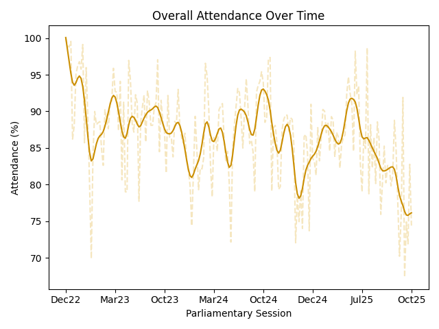
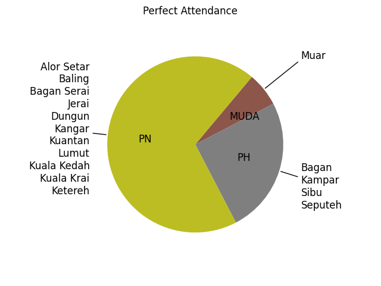
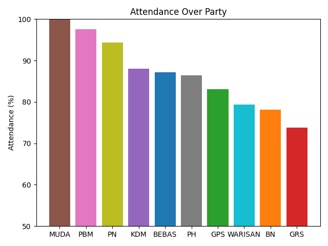
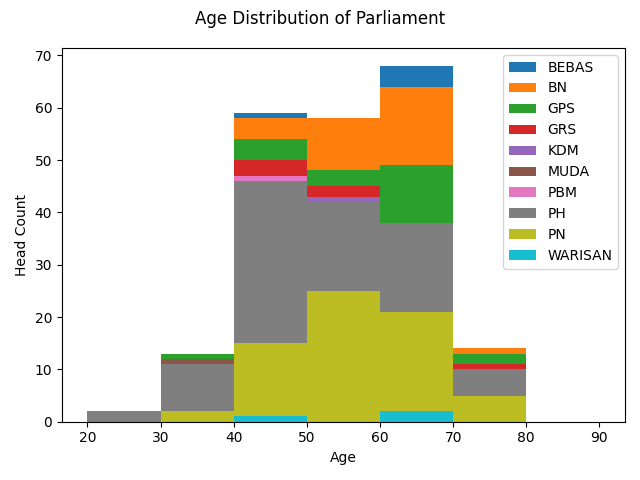
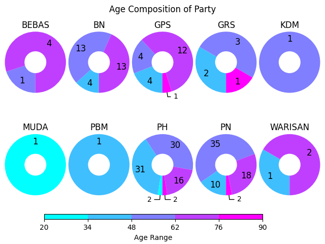
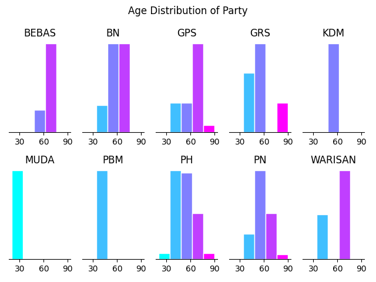

# Attendance of 15th Malaysian Parliament

## Details
- Tracking Range: Total 170 sessions from **2022-Dec-19** to **2025-Mar-06**, and **2025-May-05**
- Vacant Seat: _Kemaman_ and _Pulai_ were vacant for 29 and 5 several sessions respectively

## Results











## Method

1. Download [Hansard](https://www.parlimen.gov.my/hansard-dewan-rakyat.html?uweb=dr&arkib=yes)
2. Parse attendance pages into [CVS](dataset) using LLM with prompt:
   ```text
   tabulate the attendance of the member of parliment from this pdf,
   and save into CSV with format: Absent/Present,Name without tittle,Constituency
   ```
3. Plot with 
   ```commandline
   python plot.py
   ```
